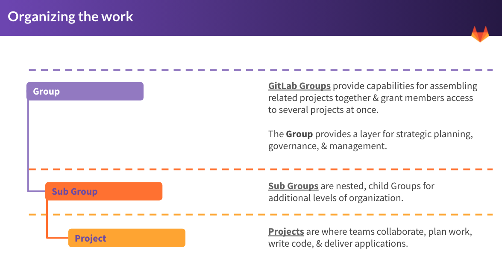

# Courseware as Code Workshop

Welcome to the GitLab Courseware as Code Workshop. This workshop will introduce participants to the basics of Courseware as Code and demonstrate how to set up a Courseware as Code repository in [GitLab.com](https://gitlab.com/).

# Workshop Outline
1. Introduction to Courseware as Code Concepts
2. Create a free GitLab.com account
3. Set up the Courseware as Code repository by cloning the template
4. Add basic content to the repository
5. Set up the Courseware as Code Tools repository

`
