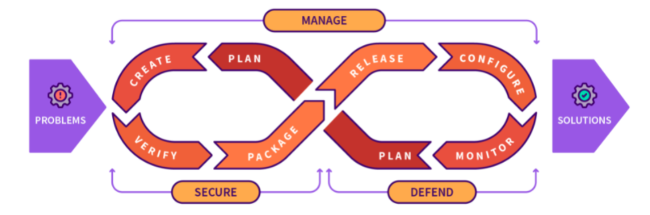
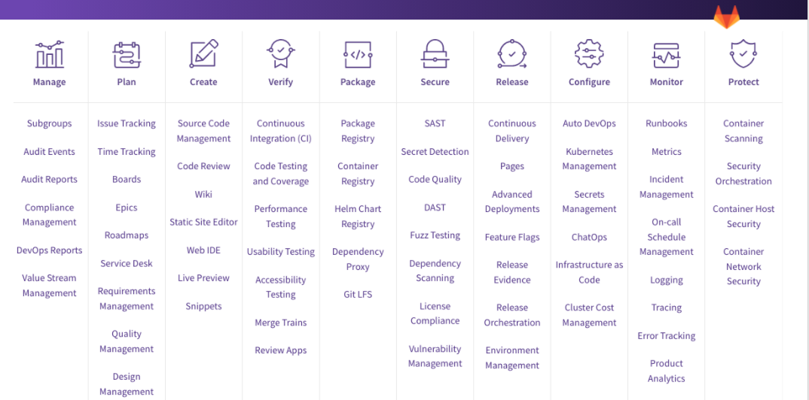

# Courseware as Code Workshop

Welcome to the GitLab Courseware as Code Workshop. This workshop will introduce participants to the basics of Courseware as Code and demonstrate how to set up a Courseware as Code repository in [GitLab.com](https://gitlab.com/).

## Workshop Outline
1. Introduction to Courseware as Code Concepts
2. Create a free GitLab.com account
3. Set up the Courseware as Code repository by cloning the template
4. Add basic content to the

## Introduction to Courseware as Code and DevOps

**Courseware as Code** (CwaC) is a revolutionary approach to designing, creating, and maintaining course content and all related assets based on a foundation of DevOps and continuous integration (CI) and continuous development (CD) philosophies. CwaC extends the process, tools, and culture of DevOps designing, creating, and maintaining education content and assets of all types.

**DevOps** is a set of practices and tools that combines software development and information technology operations. DevOps is also a cultural transformation; it improves collaboration between developers and operations team members by implementing a mindset that promotes feedback loops, continuous improvement, loosely coupled architecture teams.  

The DevOps process starts with a problem and moves through each stage starting with plan and moving through in a continuous cycle to monitor and then back to plan. The 7 stages are described in [detail here](https://about.gitlab.com/stages-devops-lifecycle/).

The tools and functions available in each stage.

### DevOps Stages and Tools used in Courseware as Code
| Stage| Tools and Functions | CwaC Usage | CwaC Tools |
|------|---------------------|------------|------------|
| Plan | Issues, Issue Tracking, Time Tracking, Boards, Epics| Issues are assignments. Issues can have due-dates, milestones, and can be tracked and organized into Epics. Labels are used further categorize issues.|  Issues can be automatically assigned to each student in your Group |

### Courseware as Code Origins

The exact origin of CwaC in action is unknown to us. We do know that many open-source projects and open-core companies have used this approach to maintain their documentation and handbook type content for many years.

The U.S. Army Cyberschool, a GitLab customer, officially coined the term Courseware as Code in their publication `Courseware as code setting a new bar for transparency and collaboration` published in the IEEE Frontiers in Education Conference in 2018(footnote 1) and subsequent publication in `Courseware as Code: Instituting Agile Courseware Collaboration` in IEEE Security & Privacy in 2020 (footnote2). According the authors "Using a foundation of DevOps and Continuous Integration/Continuous Delivery (CI/CD) philosophies, our idea for Courseware as Code extends the idea of ”Everything as Code” to educational content. Leveraging applicable aspects of the software development lifecycle to courseware facilitates discussions of suggested changes amongst faculty, provides transparency in updates, enables custom workflows based on the complexity of course content, and allows faculty, students, and workforce members to identify issues and contribute content."

In the CwaC model, traditional documents such as slide presentations, word documents, spreadsheets, and other files, with markup language formats. CI pipelines are used to create PDFs, html5, these markdown files are

# Footnotes
1. Rodriguez, Julianna, et al. "Courseware as code setting a new bar for transparency and collaboration." 2018 IEEE Frontiers in Education Conference (FIE). IEEE, 2018.
2. Rodriguez, Julianna M., et al. "Courseware as Code: Instituting Agile Courseware Collaboration." IEEE Security & Privacy 18.6 (2020): 59-62.
